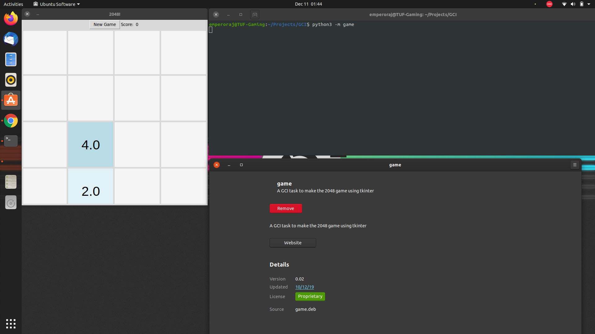

# game_2048
A gci task to make the 2048 game

<h1>Steps to install the game, and play.</h1>
Prior requirments: Numpy and Tkinter, python3
Download the game.deb file, and after downloading, just open the file, it would open the software control center, and from there, you can install it. 
To play the game: 
python3 -m game 
That would launch the game 

